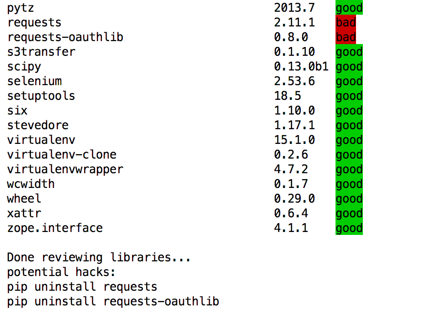

# pypi_hacked_names

This project was written to help protect innocent python developers who happen
to make a typo in a library name and install a malicious package out of PYPI.

# Purpose
The goal of this program is to automatically find possible compromises 
with installed packages.

# How to use
**Note:** `hack_check.py` is written to support python version 2.7.x.

1. Clone the repo or download `hack_check.py` and `malicious_names.json` to the
   same directory.

2. In each project, activate the virtual environrment and then run `python2
   path/to/your/hack_check.py`.
    
   The output will look something like this in verbose mode:  

   

3.  If you do have a potentially compromised library, don’t use `pip uninstall`
    as it runs code in the package. Go in the directory and delete the package.

# The Blog Article
http://www.bytelion.com/pypi-python-package-hack/

#The hacker news article:
https://news.ycombinator.com/item?id=15256121

#Twitter Hashtag:
(#)PyPiNameHack  | https://twitter.com/hashtag/PyPiNameHack?src=hash

#Reddit Posting:
https://www.reddit.com/r/linux/comments/709a4t/pypi_compromised_by_fake_software_packages/
https://www.reddit.com/r/programming/comments/4n60mp/taking_over_17000_hosts_by_typosquatting_package/
NPM too!
https://www.bleepingcomputer.com/news/security/52-percent-of-all-javascript-npm-packages-could-have-been-hacked-via-weak-credentials/

# To Do
See list of action items.  Ifyou want to contribute.. please do! 
